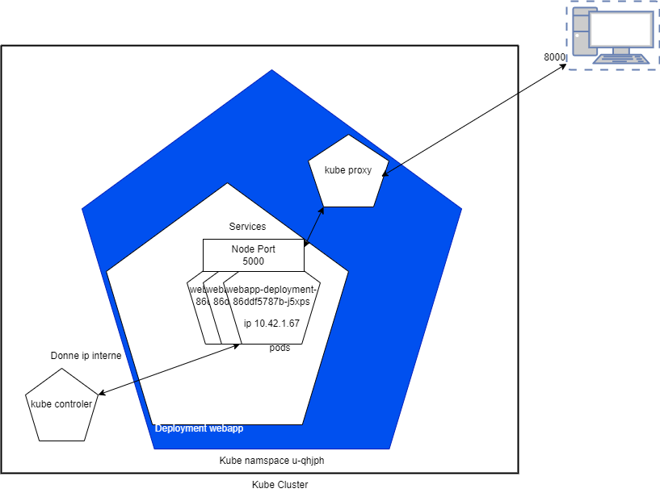
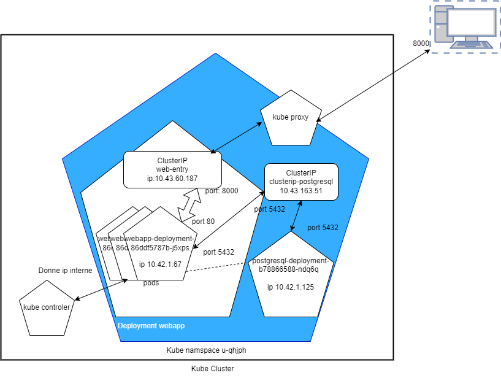
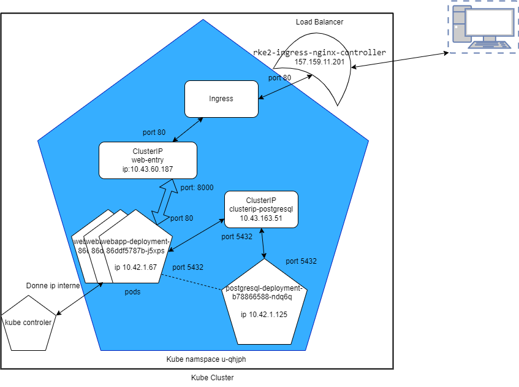
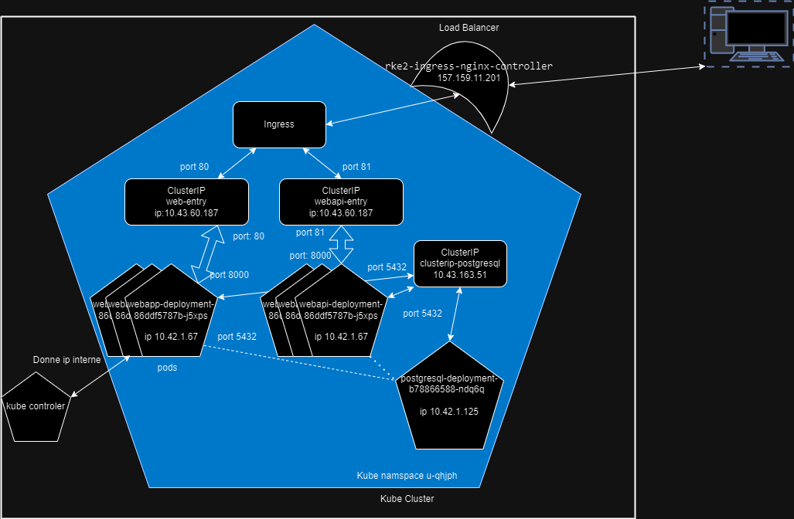

# CSC-8567-

### Defi 2

### Defi 3

Le cluster IP créé une ip virtuelle qu'il définit en tant que point d'entrée des pods et fait le lien avec plusieurs pods via un label. Le node port bind un port à plusieurs pods. Le cluster IP est disponible que de l'interieur du cluster.

Le choix d'un pods pour une base de donnée est une mauvaise idées car si le pod est éteint ou redéployé alors la base perd tout son contenu.

KubeDNS crée des entrées sur les ressources de type Service en utilisant le nom du Service, le namespace ou les informations des pods.

### Defi 4

### Defi 5

